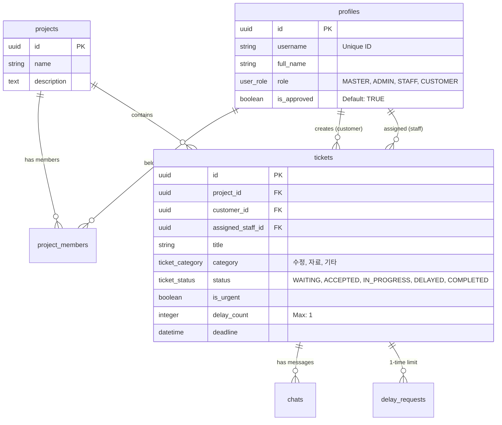

# NuDesk 시스템 설계서 (Final)

## 1. 개요
회사(마스터, 관리자, 직원)와 고객 간의 프로젝트 기반 [접수 및 협업 관리] 시스템입니다.

## 2. 권한 체계
- **MASTER**: 시스템 전체 관리자 (단 1명). 인력 등록 및 모든 데이터 접근 권한.
- **ADMIN**: 실무 운영 관리자. 프로젝트 생성, 인력 배치, 티켓 관리.
- **STAFF**: 실무진. 배정된 프로젝트의 티켓 처리 및 소통.
- **CUSTOMER**: 고객. 소속 프로젝트의 티켓 접수 및 상태 확인.

## 3. 핵심 데이터베이스 설계 (ERD)

## 4. 비즈니스 규칙
1. **프로젝트 기반 보안**: STAFF와 CUSTOMER는 본인이 소속된 프로젝트의 티켓만 볼 수 있음.
2. **연기 제한**: 티켓당 연기 요청은 단 1회(`delay_count <= 1`)로 제한됨.
3. **인력 등록**: 관리자가 직접 인력을 등록하며, 등록 즉시 승인 상태가 됨.
